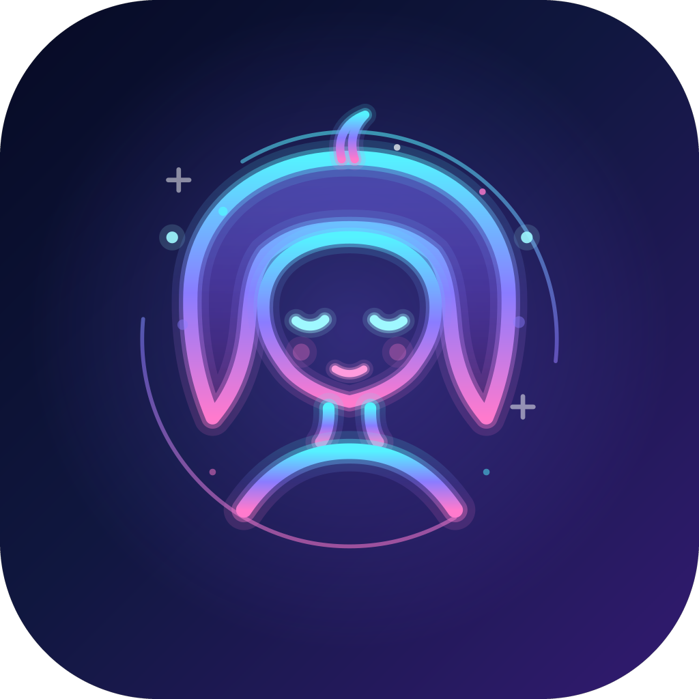

<p align="center">
  
</p>

# AIAvatar-SDK

[](https://opensource.org/licenses/Apache-2.0)
[](https://central.sonatype.com/artifact/io.github.hufeiya/corelib)
[](https://developer.android.com)
[](https://github.com/hufeiya/AIAvatar-SDK/releases)

开源 Android 3D 虚拟人 SDK：**Filament PBR 渲染 + 纯客户端 AI 对话（LLM / TTS 直连 OpenAI 兼容 API）+ 端侧口型 / 表情 / 微动作驱动**——没有自建服务端，语音合成、口型同步、情绪表达、视线、呼吸、眨眼全部在端侧完成。

| | |
|---|---|
| 渲染 | Filament 1.68（PBR）、VRM / GLB 模型、弹簧骨骼物理、IBL 环境光、程序化运镜 |
| 对话编排 | LLM 流式 → 智能断句 → 并发 TTS → 顺序播放 → 口型 / 表情全端侧驱动 |
| 多模态行内标签 | `<emo:joy>` 表情、`<act:wave>` 动作（VRMA）、`<cam:closeup>` 运镜，LLM 直出 |
| 语音 | TTS：Edge-TTS（**免费无 Key**）/ OpenAI 兼容 / 火山引擎；LLM：任意 OpenAI 兼容端点 |
| 其他 | SillyTavern 人物卡、多语言（zh / en）、可选技能框架（猜拳 / 看这边 / 模仿我） |

## 特性一览

| 弹簧骨骼 | 拟人微动作 | 52 表情 |
|:---:|:---:|:---:|
| **弹簧骨骼物理**<br>头发 / 衣物 / 饰品随动作实时摆动，拖拽身体、呼吸起伏都会联动 | <br>**拟人微动作**<br>呼吸（说话时加快）、眼球 saccade 微动、注视镜头、自然眨眼、口型同步——全部端侧驱动 | **52 表情驱动**<br>ARKit 52 blendshapes + VRM 预设情绪，LLM 行内 `<emo:>` 直出，缺失 morph 自动降级 |
| **导入人物卡**<br>SillyTavern V1 / V2 / V3 PNG 卡即点即用，内置 18 张预置角色，人设与提示词可覆写 | **虚拟人技能**<br>猜拳（本地出拳 + 看图 / MediaPipe 裁判）、看这边（转头反应游戏）、模仿我（摄像头动作镜像模仿），框架可扩展 | **程序化运镜**<br>LLM 行内 `<cam:closeup>` 直出镜头语言，特写 / 远景 / 环绕一键切换，手势自由观察 |

**更多特性**

- **纯客户端对话管线**：LLM 流式 → 智能断句 → 并发 TTS → 顺序播放，无自建服务端
- **免费开箱即说**：Edge-TTS（免 Key）+ 系统内置 ASR（免 Key），一个 Key 都不填也能语音对话
- **服务商内置目录**：硅基流动 / 火山引擎 / OpenRouter 一键切换，任意 OpenAI 兼容端点 `baseUrl` 覆盖
- **多模态行内标签**：`<emo:joy>` 表情、`<act:wave>` 动作（内置 334 个 VRMA 动画）、`<cam:closeup>` 运镜，LLM 单流直出
- **视频通话模式**：摄像头注视（看镜头 / 跟随你的脸）、表情跟随、动作模仿
- **导入外部 VRM 模型**：文件选择器导入即换人，表情目录自动刷新、对话上下文自动轮换
- **语音输入三种形态**：按住说话 / 连续聆听（VAD 自动断句）/ 系统 ASR
- **中英双语**：提示词、默认音色、UI 文案全量 zh / en
- **开箱即亮的渲染**：内置 IBL 环境光零资产；Compose（`AvatarView`）与传统 View（`AvatarSurfaceView`）双入口
- **对话历史持久化**：Room 存储、多上下文管理、人物卡跨会话重建自动重放

## 架构

```
:app  （Demo：全功能演示 + 最小接入样例）
 │
 ├──> :avatar-orchestrator   会话编排：LLM 流 / TTS 管线 / 表情仲裁 / 技能框架
 │      │                      + AIAvatarSdk 高阶门面（配置装配一步到位）
 │      └──> :avatar-ai-adapter   LlmAdapter / TtsAdapter / AsrAdapter 接口与实现
 │
 └──> :corelib               Filament 渲染底座：AvatarController
                               + AvatarView（Compose）/ AvatarSurfaceView（传统 View）
```

依赖方向只允许向下；adapter 不感知渲染，corelib 不感知 AI。

## 快速开始

### 0. 环境要求

- Android Studio（AGP 8.13+ / Kotlin 2.0+），`minSdk 29`
- `:corelib` 含 NDK 原生构建，装好 NDK 后 Gradle 自动编译

### 1. 集成模块

**方式 A：Maven 依赖（推荐）**——三个库模块已发布到 Maven Central：

```kotlin
// 你的 app/build.gradle.kts
dependencies {
    implementation("io.github.hufeiya:corelib:0.1.1")                 // 渲染底座
    implementation("io.github.hufeiya:avatar-orchestrator:0.1.1")     // 会话编排（含 AIAvatarSdk 门面）
    // io.github.hufeiya:avatar-ai-adapter 会作为 orchestrator 的传递依赖自动引入
}
```

**方式 B：源码集成**——把 `corelib/`、`avatar-ai-adapter/`、`avatar-orchestrator/` 三个目录拷入（或 git submodule 引入）你的工程：

```kotlin
// settings.gradle.kts
include(":corelib", ":avatar-ai-adapter", ":avatar-orchestrator")

// 你的 app/build.gradle.kts
dependencies {
    implementation(project(":corelib"))
    implementation(project(":avatar-orchestrator"))
}
```

### 2. 几行代码，先显示虚拟人

```kotlin
class DemoActivity : ComponentActivity() {
    override fun onCreate(savedInstanceState: Bundle?) {
        super.onCreate(savedInstanceState)
        setContent {
            val controller = rememberAvatarController()

            AvatarView(
                modifier = Modifier.fillMaxSize(),
                controller = controller,
                config = AvatarConfig(), // 内置默认环境光，零资产开箱即亮
            )

            LaunchedEffect(Unit) {
                controller.loadModel("model.vrm") // assets/ 里放你自己的 VRM 模型
            }
        }
    }
}
```

传统 View（非 Compose）工程用 `AvatarSurfaceView`：

```kotlin
val avatarView = AvatarSurfaceView(this)               // 生命周期自动绑定 Activity
setContentView(avatarView)
avatarView.controller.loadModel("model.vrm")
```

模型就绪状态通过 `controller.state`（`Idle → Loading → Ready / Error`）观察。

### 3. 让她开口说话（免费，无需任何 Key）

```kotlin
val scope = rememberCoroutineScope()
val session = remember {
    AvatarSession(
        scope = scope,
        llm = null,                    // 不传 LLM = 纯说话会话
        tts = EdgeTtsAdapter(),        // 微软 Edge 朗读接口，免费
        controller = controller,
    ).apply {
        ttsConfig = TtsConfig(
            model = "edge-readaloud",
            voice = "zh-CN-XiaoxiaoNeural",
            responseFormat = "mp3",
        )
    }
}

// 模型就绪后：启动口型/表情/眨眼/呼吸驱动，说一句开场白
LaunchedEffect(state) {
    if (state is AvatarState.Ready) {
        session.startFaceDriving()
        session.speak("<emo:joy>你好呀！很高兴见到你。") // 行内标签会变成表情
    }
}
```

### 4. 开启对话（填一个 API Key）

**方式 A：`AIAvatarSdk` 门面（推荐）**——adapter 工厂、配置解析、会话重建全部收拢，一条 `configure` 开聊：

```kotlin
val chat = AIAvatarSdk(scope, controller, applicationContext)

// 内置三家服务商目录（硅基流动 / 火山引擎 / OpenRouter），模型/音色留空 = 服务商默认
chat.configure(AIAvatarSdk.ChatConfig(apiKey = "sk-...", ttsEngine = TtsEngine.EDGE))

chat.send("今晚吃什么好？")            // LLM 流式回复，逐句 TTS 播报
chat.interrupt()                       // 随时打断
```

配置（key/模型/音色/语言/上下文 id…）任何变化在下一次 `configure` 时自动重建会话；自定义 OpenAI 兼容端点传 `baseUrl` 覆盖即可，模型名原样透传。

**方式 B：直接装配 `AvatarSession`**（要更细的控制时）：

```kotlin
val session = remember {
    AvatarSession(
        scope = scope,
        llm = OpenAiCompatibleLlmAdapter(           // 任意 OpenAI 兼容端点
            baseUrl = "https://api.siliconflow.cn/v1",
            apiKey = "sk-...",
        ),
        tts = EdgeTtsAdapter(),
        controller = controller,
    ).apply {
        ttsConfig = TtsConfig(model = "edge-readaloud", voice = "zh-CN-XiaoxiaoNeural", responseFormat = "mp3")
        llmConfig = LlmConfig(
            baseUrl = "https://api.siliconflow.cn/v1",
            apiKey = "sk-...",
            model = "Qwen/Qwen3.8-27B",
        )
    }
}

session.send("今晚吃什么好？")        // LLM 流式回复，逐句 TTS 播报
session.interrupt()                  // 随时打断（LLM + TTS + 播放三层即刻静默）
```

用户消息经 `session.events`（`SharedFlow<AvatarEvent>`）回吐全过程：`SentenceQueued / SentenceStarted / EmotionChanged / TurnCompleted / TurnFailed…`。

> 完整可运行的对照实现：[app/src/main/java/com/neethu/aiavatar_sdk/SimpleDemoActivity.kt](app/src/main/java/com/neethu/aiavatar_sdk/SimpleDemoActivity.kt)（约 200 行，只 import SDK 公开 API）。

## 资产准备

| 资产 | 必须 | 说明 |
|---|---|---|
| VRM / GLB 模型 | ✅ | 放 `assets/`，`controller.loadModel("model.vrm")`；本地文件用 `loadModelFromFile()` |
| IBL 环境光（.ktx） | 可选 | **内置默认环境光**（`AvatarConfig()` 零资产即得）；要自定义时放 `assets/` 传 `AvatarConfig(iblPath = …)`，传 `AvatarConfig.IBL_NONE` 关闭 |

口型同步、眨眼、呼吸、表情仲裁由会话内建的 FaceDriver 自动驱动，无需额外接线。

## API 速查

**`AvatarController`**（渲染，corelib）
`loadModel / loadModelFromFile` · `state: StateFlow<AvatarState>` · `setExpression` · `playVrmaAnimation / setVrmaIdleAnimation` · `setLookAtTarget` · `setCameraShot / orbitCamera / resetCamera` · `captureFrame` · `updateRenderSettings`

**渲染入口**（corelib）
`AvatarView(modifier, controller, config)` Compose · `AvatarSurfaceView(context, attrs, style, config, controller)` 传统 View（生命周期自动绑定 Activity/Fragment，`controller` 属性取控制器）

**`AIAvatarSdk`**（高阶门面，orchestrator）
`configure(ChatConfig, modelReady)` 装配/重建会话 · `send(text, images)` · `speak(text)` · `interrupt()` · `events / phase`（当前会话事件与阶段） · `setCharacterCard(card)`（跨重建自动重放） · `close()`。
`ChatConfig` 字段：`provider`（内置目录：SILICONFLOW / VOLCANO / OPENROUTER）· `baseUrl`（自定义端点覆盖）· `apiKey` · `llmModel`（留空=默认）· `ttsEngine`（EDGE 免费 / OPENAI_COMPATIBLE）· `ttsProvider / ttsApiKey / ttsModel / voice` · `lang` · `contextId`（换历史段落）。

**`AvatarSession`**（低阶会话，orchestrator）
`send(text, images)` LLM 回合 · `speak(text)` 纯 TTS 播报（免 LLM） · `interrupt()` · `startFaceDriving()` · `setCharacterCard(card)` · `events: SharedFlow<AvatarEvent>` · `phase: StateFlow<ConversationPhase>`

**TTS 适配器**（`TtsAdapter` 实现，adapter）
`EdgeTtsAdapter()` 免费 · `OpenAiCompatibleTtsAdapter(baseUrl, key)` 硅基流动 / OpenRouter 等 · `VolcanoEngineTtsAdapter(key)` 火山 seed-tts

**LLM 适配器**（`LlmAdapter` 实现）
`OpenAiCompatibleLlmAdapter(baseUrl, key)` —— 任何 OpenAI 兼容端点

## Demo 工程

- **`MainActivity`** —— 全功能演示：语音输入（按住说话 / 连续聆听 / 系统 ASR）、视频通话模式（摄像头注视 / 动作模仿 / 表情跟随）、技能（猜拳 / 看这边 / 模仿我）、画质设置、人物卡管理、对话历史。
- **`SimpleDemoActivity`** —— 本 README 的最小接入对照样例：

```bash
adb shell am start -n com.neethu.aiavatar_sdk/.SimpleDemoActivity
```

**签名打包**：在仓库根目录放一个 `keystore.properties`（四行：`storeFile` / `storePassword` / `keyAlias` / `keyPassword`，文件与密钥库都被 .gitignore 排除），`./gradlew :app:assembleRelease` 即产出正式签名的 `app/build/outputs/apk/release/AIAvatar-v<版本>-release.apk`；没有该文件时自动回落 debug 签名，克隆即跑。正式签名一经上架请永久保管密钥库——签名变了无法覆盖安装。

`docs/` 目录是面向维护者的内部文档（架构交接、调试协议、技能可行性报告）。

## 参考项目与致谢

本项目的实现大量受益于以下开源项目与资产来源：

**渲染与模型格式**

- [Filament](https://github.com/google/filament)（Google）— PBR 渲染引擎，`:corelib` 的渲染底座
- [three-vrm](https://github.com/pixiv/three-vrm)（pixiv）— VRM 运行时语义的参照实现（表情权重、hips 拖拽、视线等行为对齐）
- [VRM](https://vrm.dev/)（VRM Consortium）— 开放 3D 虚拟人模型格式与 VRMA 动画规范

**编排与「生命感」算法**

- [AIRI](https://github.com/moeru-ai/airi)（moeru-ai）— 对话编排与微动作算法的参照实现：流式断句、元音口型驱动、眼球 saccade、系统提示词组装等多处逐常量移植，口型标定 profile 直接复用

**AI 服务与协议**

- [edge-tts](https://github.com/rany2/edge-tts) — Edge-TTS 免费语音合成协议的开源实现，`Sec-MS-GEC` 鉴权算法的对齐来源
- [SillyTavern](https://github.com/SillyTavern/SillyTavern) — 人物卡（Tavern Card）格式定义；内置预置卡含官方 5 张（[SillyTavern-Content](https://github.com/SillyTavern/SillyTavern-Content)）

**端侧感知**

- [MediaPipe](https://developers.google.com/mediapipe)（Google）— 手势 / 人脸 / 姿态 Landmarker，猜拳判定、看这边、动作模仿的感知底座

**动作资产**

- [Mixamo](https://www.mixamo.com/)（Adobe）— 内置 VRMA 动画库的原始动作来源（FBX → VRMA 转换）

以及 Kotlin Coroutines / Jetpack Compose / OkHttp / Room 等开源基础设施——一并致谢。

## License

[Apache License 2.0](LICENSE)
